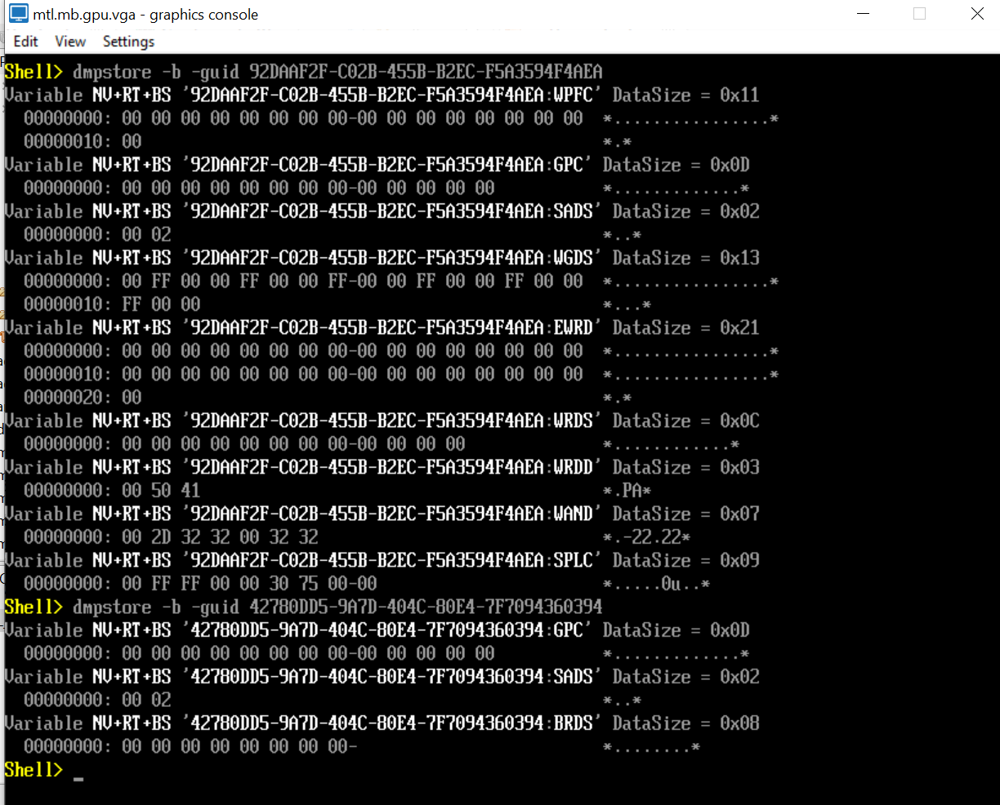

<!--
@file

  This file provides the details for CnvFeaturePkg.

  @copyright
  INTEL CONFIDENTIAL
  Copyright (C) 2021 Intel Corporation.

  This software and the related documents are Intel copyrighted materials, and your
  use of them is governed by the express license under which they were provided to
  you ("License"). Unless the License provides otherwise, you may not use, modify,
  copy, publish, distribute, disclose or transmit this software or the related
  documents without Intel's prior written permission.

  This software and the related documents are provided as is, with no express or
  implied warranties, other than those that are expressly stated in the License.

@par Specification Reference:
-->
# Overview
* **Feature Name:** Connectivity Feature Package
* **PI Phase(s) Supported:** DXE
* **SMM Required?** NO

## Purpose
Provide the implementation of BIOS requirements needed for Intel Connectivity.

# High-Level Theory of Operation
* Platform driver or CnvDxe driver installs gCnvUefiVariableConfigProtocolGuid with CNV configuration data.
* CnvUefiConfigVariablesVer2 driver always gets dispatched and publishes CNV UEFI variables - thermal, regulatory(SAR), diversity, etc..
* CnvDxe driver publishes CNV SSDT which includes required ACPI control methods for Connectivity.
* CnvVfrSetupMenu driver creates and adds Connectivity setup page to HII for CNV configuration.

## Modules
* CnvUefiConfigVariablesVer2.inf - Publish CNV UEFI variables with hardcoded default settings.
* CnvDxe.inf                     - To install gCnvUefiVariableConfigProtocolGuid and publish CNV SSDT.
* CnvVfrSetupMenu.inf            - To create and add Connectivity setup page to HII.

## Libraries
* Gmio.asl         - Provide GMIO method to covert PCIe endpoint PCI config space to MMIO address.
* EpOpRegion.asl   - Provide endpoint OperationRegions needed by CNV.
* Wist.asl         - Provide WIST method to check if the supported CNV is present.

## Key Functions
* N/A

## Configuration
* Set gCnvFeaturePkgTokenSpaceGuid.PcdCnvFeatureEnable to TRUE to enable CNV UEFI Config feature.
* Set gCnvFeaturePkgTokenSpaceGuid.PcdCnvSetupMenu to TRUE to enable CNV setup page.
* Set gCnvFeaturePkgTokenSpaceGuid.PcdCnvUefiVariables to TRUE to enable CNV UEFI variables.
* Set gCnvFeaturePkgTokenSpaceGuid.PcdCnvUefiVarVersion to the version needed by platform.
* Set gCnvFeaturePkgTokenSpaceGuid.PcdCnvAcpiTables to TRUE to enable CNV ACPI tables.
* Set gCnvFeaturePkgTokenSpaceGuid.PcdIntelWifiDsmFunc1 to TRUE to enable Intel WiFi _DSM function 1.
* Set gCnvFeaturePkgTokenSpaceGuid.PcdIntelWifiDsmFunc2 to TRUE to enable Intel WiFi _DSM function 2.
* Remove gCnvFeaturePkgTokenSpaceGuid.PcdIntelWifiDsmFunc3, due to merge to Intel WiFi _DSM function 11.
* Set gCnvFeaturePkgTokenSpaceGuid.PcdIntelWifiDsmFunc4 to TRUE to enable Intel WiFi _DSM function 4.
* Set gCnvFeaturePkgTokenSpaceGuid.PcdIntelWifiDsmFunc5 to TRUE to enable Intel WiFi _DSM function 5.
* Set gCnvFeaturePkgTokenSpaceGuid.PcdOemWifiDsmFunc11 to TRUE to enable OEM WiFi _DSM function 11.
* Set gCnvFeaturePkgTokenSpaceGuid.PcdMaxRootPortNumber to the number of PCIe root port supported by platform.
* Set gCnvFeaturePkgTokenSpaceGuid.PcdMaxUsb2PortNumber to the number of USB2 port supported by platform.
* Remove gCnvFeaturePkgTokenSpaceGuid.PcdCnvLegacyAcpiTables, due to un-support CNV legacy ACPI tables.
* Set gCnvFeaturePkgTokenSpaceGuid.PcdCnvSetupMenuConfig to determine formset display location
* Set gCnvFeaturePkgTokenSpaceGuid.PcdWifiDsmSupport to TRUE to enable Wifi DSM support.
* Set gCnvFeaturePkgTokenSpaceGuid.PcdBtDsmSupport to TRUE to enable BT DSM support.
* Set gCnvFeaturePkgTokenSpaceGuid.PcdCnvIntegratedSupport to TRUE to enable integrated CNV support.
* Set gCnvFeaturePkgTokenSpaceGuid.PcdCnvDiscreteSupport to TRUE to enable discrete CNV support.
* Set gCnvFeaturePkgTokenSpaceGuid.PcdBtAudioOffloadSupport to TRUE to enable BT AudiOffload support.
* Set gCnvFeaturePkgTokenSpaceGuid.PcdPrebootBleSupport to TRUE to enable Preboot BLE support.
* Set gCnvFeaturePkgTokenSpaceGuid.PcdDynamicSarSupport to TRUE to enable Dynamic SAR support.
* Set gCnvFeaturePkgTokenSpaceGuid.PcdBtUsbInterfaceSupport to TRUE to enable BT USB interface support.
* Set gCnvFeaturePkgTokenSpaceGuid.PcdSkipVidDidCheck to FALSE for SkipVidDidCheck variable .

For **client platform**. The definition of each field is listed below:
  - Bit 31    --- Whether to show formset, 1 - show, 0 - hide
  - Bit 30:24 --- Reserved
  - Bit 23:16 --- Formset display order
  - Bit 15:0  --- The id of form to display formset under Advanced menu

## Data Flows
* N/A

## Control Flows
* N/A

## Build Flows
* No special tools are required to build this feature.

|   OS    | Compiler |
|:-------:|:--------:|
| Windows | VS2019   |
| Windows | CLANG11  |
* Step1. prepare build environment with VS2019 or CLANG11 as needed
* Step2. set PACKAGES_PATH=%cd%/Edk2;%cd%/Edk2Platforms/Platform/Intel;%cd%/Intel;%cd%/Intel/Features/Connectivity
* Step3. Edk2\edksetup.bat
* Step4. build -p CnvFeaturePkg/CnvFeaturePkg.dsc -a IA32 -a X64 -b DEBUG
* Step5. build -p CnvFeaturePkg/CnvFeaturePkg.dsc -a IA32 -a X64 -b RELEASE

## Test Point Results
Dumping the CNV UEFI variables before and after refactoring gave similar results.
Dumped ACPI tables and checked all CNV ACPI tables are present in DSDT and SSDT as expected.
Booted to BIOS menu and CNV settings can be configured via the the knobs in CNV setup page.

## Functional Exit Criteria
* Once the feature is enabled on the platform, dumping the CNV UEFI variables from the UEFI Internal shell
give results as shown in below link if PcdCnvUefiVariables is TRUE.

* Once the feature is enabled on the platform, CNV SSDT, methods and devices shall present in ACPI tables dumped from OS if PcdCnvAcpiTables is TRUE.

* Once the feature is enabled on the platform, CNV setup page shall present in BIOS menu if PcdCnvSetupMenu is TRUE.

## Feature Enabling Checklist
* Add CnvFeature entry and path to your build file and check if all required packages/libraries exists for this package.
* Add PostMemory.fdf entry and path to your flash map file.
* Add CnvFeaturePkg.dec to Package List of BoardPkg PcdInit file.
* Add CnvFeaturePkgPcdInit.dsc to BoardPkg PcdInit file to initialize CNV Feature Package default PCD.
* Add below PCDs to [PcdsFixedAtBuild] section of BoardPkg PcdInit file and configure them according to platform.
  - gCnvFeaturePkgTokenSpaceGuid.PcdCnvSetupMenu
  - gCnvFeaturePkgTokenSpaceGuid.PcdCnvAcpiTables
  - gCnvFeaturePkgTokenSpaceGuid.PcdCnvUefiVariables
  - gCnvFeaturePkgTokenSpaceGuid.PcdCnvUefiVarVersion
  - gCnvFeaturePkgTokenSpaceGuid.PcdMaxRootPortNumber
  - gCnvFeaturePkgTokenSpaceGuid.PcdMaxUsb2PortNumber
* Set value of gCnvFeaturePkgTokenSpaceGuid.PcdCnvFeatureEnable to 'TRUE' in BoardPkg PcdUpdate file.
* Configure PcdCnvBoardConfig PCD before SiliconInit PreMem Phase.
* Add CNV_VFR_CONFIG_SETUP and CNV setup page entry with form guid - gCnvFeatureSetupGuid to platform BIOS setup menu if PcdCnvSetupMenu is set to TRUE.
* Include CnvDsdt.asl located in AcpiTables/Dsdt folder in platform DSDT.
* Install gCnvFormPlatformProtocolGuid with platform specific callback function for updaing platform bios knobs accordingly when CNV form is changed. (Optional)

## Common Optimizations
* N/A
## Unit Test build flows
|   OS    | Compiler |
|:-------:|:--------:|
| Windows | VS2019   |

> Step1. Prepare build environment with VS2019 as needed.
> Step2. Install the pip requirements.
         Sample : pip install -r Edk2/pip-requirements.txt
> Step3. Setup Edk2 environment.
         Sample : Edk2/edksetup.bat Rebuild
> Step4. Get the code dependencies.
         Sample : stuart_setup -c Intel/.pytool/CISettings.py -p CnvFeaturePkg -t NOOPT -a IA32,X64 TOOL_CHAIN_TAG=VS2019 --verbose
> Step5. Update other dependencies.
         Sample : stuart_update -c Intel/.pytool/CISettings.py -p CnvFeaturePkg -t NOOPT -a IA32,X64 TOOL_CHAIN_TAG=VS2019 --verbose
> Step6. Build unit test host.
         Sample : stuart_ci_build -c Intel/.pytool/CISettings.py -p CnvFeaturePkg -t NOOPT -a IA32,X64 TOOL_CHAIN_TAG=VS2019 -verbose
