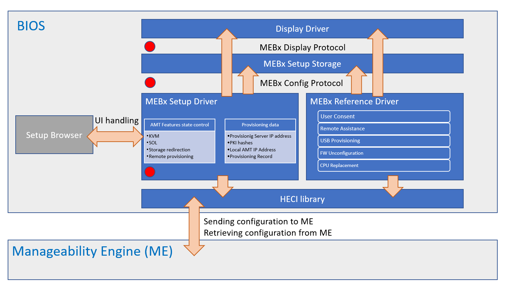

# Overview

* Feature Name: MEBx setup platform package. This is a package that provides configuration possibility to various AMT related settings by publishing setup data, that is integrated into universal setup browser.
* PI Phase(s) Supported: DXE
* SMM Required: No

## Purpose

This package publishes drivers that are required to allow configuration of various AMT features.

Currently supported AMT features:
* Active Management Technology State configuration
* Security Settings for PKI Provisioning
  - Manageability Feature Selection (Partial AMT Enable)
  - Remote Configuration
  - PKI DNS Suffix
  - Hash Certificates management
* AMT Security/Privacy Settings
  - Serial over LAN feature state
  - Storage redirection feature state
  - KVM feature state
  - User Opt-in requirement
  - Opt-in requirement configrurable by remote IT
* Bare Metal Configuration of AMT
  - Wired static IPV4 settings configuration (address, subnet mask, default gateway, DNS settings)
  - Provisioning server FQDN
  - Provisioning server IP Address
  - Power Control setttings
* AMT unprovision
* AMT Provisioning info

# High-Level Theory of Operation

### Mebx High-level Architecture Diagram



This diagram shows a complete Intel(R) MEBx solution, which consists of two components:
* MEBx Reference Code driver
* MEBx Feature package - items marked with *red circles*

Feature package contains:

* Drivers
  * **MebxDisplay** (*MebxDisplay.inf*)
    * This driver is responsible for installing the platform implementation of [MEBx Display Protocol](#MEBx-Display-Protocol). This protocol is used to display various information on user's screen as well as capture user's input. This is a non-mandatory protocol, however if it is not installed on the platform, certain features provided by the *MEBx Reference Code Driver* will be unavailable.
  * **MebxConfiguration** (*MebxConfiguration.inf*)
    * This driver is responsible for installing the platform implementation of [MEBx Config Protocol](#MEBx-Config-Protocol). This protocol is used to store crucial configuration data throughout reboots. This is a non-mandatory protocol, however if it is not installed on the platform, certain features provided by the *MEBx Reference Code Driver* will be unavailable.
  * **MebxSetup** (*MebxSetup.inf*)
    * This driver is responsible for publishing HII data and [Config Access Protocol](https://edk2-docs.gitbook.io/edk-ii-uefi-driver-writer-s-guide/12_uefi_driver_configuration/readme.3/1233_hii_config_access_protocol). This allows configuration of various AMT features from the BIOS Setup browser.

### MEBx Display Protocol

EFI Guid Name           | Guid Value
----------------------- | ----------
gMebxDisplayProtocolGuid | ```0xF82792C2-9381-4D12-BC8B-DFC4E73D5A91```

Function Name | Parameters | Comments
------------- | ---------- | --------
```ConfigureScreen```     | **MEBX_DISPLAY_PROTOCOL** *```*This```*</br>**SCREEN_MODE** *```Mode```*</br> | Function sets specified graphics mode.
```DisplayText```         | **MEBX_DISPLAY_PROTOCOL** *```*This```*</br>**MEBX_MSG_ID** *```MsgId```*</br> | Function prints MEBx information string to screen.
```DisplayError```        | **MEBX_DISPLAY_PROTOCOL** *```*This```*</br>**MEBX_MSG_ID** *```MsgId```*</br> **UINT32** *```Delay```*</br>| Function prints MEBx error string to screen.
```DisplayImage```        | **MEBX_DISPLAY_PROTOCOL** *```*This```*</br>**UINT8** *```*Bitmap```*</br>**UINT32** *```ImageWidth```*</br>**UINT32** *```ImageHeight```*  | Function draws image on the graphics screen.
```GetUserInput```        | **MEBX_DISPLAY_PROTOCOL** *```*This```*</br>**MEBX_USER_INPUT** *```*UserInput```* | Function reads user input.
```GetScreenResolution``` | **MEBX_DISPLAY_PROTOCOL** *```*This```*</br>**UINT16** *```*Width```*</br>**UINT16** *```*Height```*  | Function gets information about current screen resolution.
```ClearScreen```         | **MEBX_DISPLAY_PROTOCOL** *```*This```* | Function clears a screen's content.

</br>

#### Screen Mode enumeration:
```C
typedef enum {
  ScreenModeMebx,
  ScreenModeBios
} SCREEN_MODE;
```

</br>

#### MEBx User Input enumeration:
```C
typedef enum {
  MebxUserInputNoInput,
  MebxUserInputEsc,
  MebxUserInputEnter,
  MebxUserInputOtherKey
} MEBX_USER_INPUT;
```

#### MEBx Message ID enumeration:
```C
typedef enum {
  RecordInvalidError,
  LoginFailedError,
  ProvDataMissingError,
  FailedEnabledFeaturesError,
  FailedUpdateManageabilityModeError,
  AppFailedLoadError,
  FwUpdateError,
  FwUpdateDeprecatedError,
  FailedGetProvStatusError,
  PkiDnsSuffixInvalidError,
  PkiDnsSuffixError,
  ConfigServerFqdnInvalidError,
  RemoteConfigEnDisInvalidError,
  RemoteConfigEnDisError,
  DefaultHashEnInvalidError,
  DefaultHashEnError,
  DefaultHashDisError,
  CustomHashConfigInvalidError,
  CustomHashConfigError,
  DeleteHashError,
  CustomHashStateError,
  InvalidCustomHashError,
  SolStorageRedirConfigInvalidError,
  SolStorageRedirDataError,
  SolStorageRedirAuthProtError,
  HostNameLargeError,
  DomainNameLargeError,
  DhcpInvalidError,
  IdleTimeoutInvalidError,
  IdleTimeoutError,
  ProvServerInvalidError,
  ProvServerPortInvalidError,
  Ipv4ParamsInvalidError,
  PwdPolicyInvalidError,
  Ipv6DataInvalidError,
  Ipv6SettingError,
  SharedFqdnInvalidError,
  DdnsInvalidError,
  KvmStateInvalidError,
  KvmStateError,
  OptInDataInvalidError,
  MeProvHaltDataInvalidError,
  MeProvHaltError,
  ManualSetupConfDataInvalidError,
  ProvServAddressError,
  HashHandlesError,
  HashEntriesError,
  AddCustomHashError,
  MeProvActivateError,
  Ipv4ParametersError,
  FqdnSettingError,
  OptinDataError,
  CompleteConfigFailedError,
  NewPasswordError,
  PowerPackagesError,
  ConinError,
  AmthiGetAmthiInterfaceVersionApiError,
  AmthiGetKvmStateApiError,
  AmthiGetPolicyAmtRedirectionStateApiError,
  AmthiGetOptinStateApiError,
  AmthiGetConfigSvrDataApiError,
  AmthiGetZtcConfigApiError,
  AmthiGetPkiFqdnSuffixApiError,
  AmthiGetIpv4ParamsApiError,
  AmthiGetFqdnApiError,
  AmthiGetIdleTimeoutApiError,
  AmthiGetProvisionStateApiError,
  AmthiGetAuditRecordApiError,
  AmthiGetHashDataApiError,
  AmthiGetConnectionStatusApiError,
  AmthiGetIpv6LanIntfSettingsApiError,
  AmthiGetPrivacyLevelApiError,
  AmthiGetPowerPolicyApiError,
  AmthiSetMebxEnterStateApiError,
  AmthiSetMebxExitStateApiError,
  KvmActiveSessionMsg,
  AmthiSetIpv4ParamsApiError,
  AmthiSetPkiFqdnSuffixApiError,
  AmthiSetSolStorageRedirectionStateApiError,
  AmthiSetKvmStateApiError,
  AmthiSetPwdPolicyApiError,
  AmthiSetFqdnApiError,
  AmthiSetOptinStateApiError,
  AmthiSetIdleTimeoutApiError,
  AmthiSetConfigServerApiError,
  AmthiPowerPolicyApiError,
  AmthiSetHashStateApiError,
  AmthiSetZtcApiError,
  AmthiStopConfigUnprovisionApiError,
  MeGetUserCapsApiError,
  MeGetFwCapsApiError,
  MeGetFwEnabledFeatureApiError,
  MeMeWaitFwFeatureAvailableApiError,
  MeSetAmtStateApiError,
  CoreUnconfigWoPassGetUnconfigStatusError,
  CoreUsbProvError,
  AmthiCloseUserInitiatedConnApiError,
  PressAnyKeyMsg,
  FoundUsbKeyMsg,
  ContinueAutoProvMsg,
  LoadingAmtMsg,
  DoneMsg,
  AmtManageabilityUsbDataMissingMsg,
  AmtManageabilityAlreadyProvMsg,
  StringNotAppliedTooManyHashesMsg,
  ConfigAppliedMsg,
  ContinueBootMsg,
  CoreCautionMsg,
  CoreCpuReplacementMsg,
  CoreFeaturesDisabledMsg,
  CoreFeaturesEnabledMsg,
  CoreConfirm1Msg,
  CoreConfirm2Msg,
  AmtManageabilityCilaMsg,
  CoreUnconfigWoPassMsg,
  AmtManualConfigUnsupportedMsg

  // Values from 0x80000 to 0x8FFFF are reserved for USB Provisioning record display
  CorruptedDataEntryStart = 0x80000,
  CorruptedDataEntryEnd   = 0x8FFFF
} MEBX_MSG_ID;
```

### MEBx Config Protocol

EFI Guid Name           | Guid Value
----------------------- | ----------
gMebxConfigProtocolGuid | ```0xB2B63AA3-6C0C-44A4-A052-2C0D85E01C96```

Function Name | Parameters | Comments
------------- | ---------- | --------
```SetMebxData```     | **UINTN** *```DataSize```*</br>**VOID** *```*Data```*</br> | Function is used to set MEBx settings.
```GetMebxData```     | **UINTN** *```*DataSize```*</br>**VOID** *```*Data```*</br> | Function is used to retrieve MEBx settings.

### MEBx Data structure

Field Name    | Comments
------------- | --------
```AmtSol```      | Serial over LAN device state:</br> ```0``` -  Disabled;</br> ```1``` - Enabled
```Reserved[3]``` | Reserved for future use


## Modules

* MebxDisplay.inf
* MebxConfiguration.inf
* MebxSetup.inf

## Configuration

Set ```gMebxFeaturePkgTokenSpaceGuid.PcdMebxFeatureEnable``` to ```TRUE``` to enable MEBx feature.</br>
**MebxDisplay** driver is configured by PCDs: PcdMebxConOutColumn, PcdMebxConOutRow, PcdMebxVideoHorizontalResolution and PcdMebxVideoVerticalResolution, and also will use PcdVideoHorizontalResolution, PcdVideoVerticalResolution, PcdConOutColumn and PcdConOutRow to restart console driver to meet requested resolution if needed. Those PCDs are used to configure screen output</br>

### Settings example

  gMebxFeaturePkgTokenSpaceGuid.PcdMebxConOutColumn             |```100```
  gMebxFeaturePkgTokenSpaceGuid.PcdMebxConOutRow                |```31```
  gMebxFeaturePkgTokenSpaceGuid.PcdMebxVideoHorizontalResolution|```1024```
  gMebxFeaturePkgTokenSpaceGuid.PcdMebxVideoVerticalResolution  |```768```

## Data flows

### MEBx Display Protocol

MEBx Display Protocol is installed in the DXE phase and is available afterwards. This protocol is also used in the Reference Code so it is highly recommended to provide the implementation. The APIs provided by this protocol can be divided into following categories according to their use cases:
* Info Prompts (```DisplayText```, ```DisplayError```)
* Screen output manipulations (```ConfigureScreen```, ```ClearScreen```)
* Image display (```GetScreenResolution```, ```DisplayImage```)
* User input (```GetUserInput```)

Info prompts are used in order to display some key messages, either info or error, onto user screen.

Parameters for ```DisplayText``` and ```DisplayError``` functions are pointer to MEBx Display Protocol and MEBx Message ID. Refer to [MEBx Message ID enumeration](#MEBx-Message-ID-enumeration) for possible values.

Example:

```C
  // Check if protocol has been installed by platform code
  Status = gBS->LocateProtocol (&gMebxDisplayProtocolGuid, NULL, (VOID**) &MebxDisplayProtocol);
  if (!EFI_ERROR (Status)) {
    // Display error message for AMTHI interface version mismatch
    Status = MebxDisplayProtocol->DisplayText (MebxDisplayProtocol, AmthiGetAmthiInterfaceVersionApiError);
  }

  return Status;
```

Screen output APIs are used to manipulate screen resolution and output. One can adjust the way data is displayed on screen by providing one's own implemenation of the protocol APIs. This is especially important for custom GUI based UEFI setups. APIs from this group are also used in the Reference Code.

Parameters for ```ConfigureScreen``` function are pointer to MEBx Display Protocol and Screen Mode. The purpose for this function is to configure both text and graphics display modes. Refer to [Screen Mode](#Screen-Mode-enumeration) for possible values.

Example:

```C
  // Check if protocol has been installed by platform code
  Status = gBS->LocateProtocol (&gMebxDisplayProtocolGuid, NULL, (VOID**) &MebxDisplayProtocol);
  if (!EFI_ERROR (Status)) {
    // Change the screen resolution for MEBx display
    Status = MebxDisplayProtocol->ConfigureScreen (MebxDisplayProtocol, ScreenModeMebx);
  }

  return Status;
```

Parameter for ```ClearScreen``` function is pointer to MEBx Display Protocol. This function clears the screen's content.

Example:

```C
  // Check if protocol has been installed by platform code
  Status = gBS->LocateProtocol (&gMebxDisplayProtocolGuid, NULL, (VOID**) &MebxDisplayProtocol);
  if (!EFI_ERROR (Status)) {
    // Clear screen contents
    Status = MebxDisplayProtocol->ClearScreen (MebxDisplayProtocol);
  }

  return Status;
```

Image display APIs are used in order to display pictures in a given format. The implementation for the functions is mandatory if platform needs to support User Consent flow.

Parameters for ```GetScreenResolution``` function are pointer to MEBx Display Protocol, pointer to Width and pointer to Height. The purpose for this function is retrieve current screen resolution, which might be needed in certain flows in order to correctly display pictures retrieved from CSME.

Parameters for ```DisplayImage``` function are pointer to MEBx Display Protocol, pointer to bitmap and pointer to Height. The purpose for this function is to  display the User Consent bitmap, which is received from CSME through HECI interface.

Example:

```C
EFI_STATUS
DisplayImage (
  UINT32                       ScreenId
  )
{
  EFI_STATUS                    Status;
  EFI_GRAPHICS_OUTPUT_BLT_PIXEL *Bitmap;
  MEBX_DISPLAY_PROTOCOL         *MebxDisplayProtol;
  UINT32                        ImgWidth;
  UINT32                        ImgHeight;
  AMT_SCREEN_RESOLUTION         Screen;

  Status = gBS->LocateProtocol (&gMebxDisplayProtocolGuid, NULL, (VOID**) &MebxDisplayProtol);
  if (EFI_ERROR (Status)) {
    return Status;
  }
  // Retrieve current video settings
  Status = MebxDisplayProtol->GetScreenResolution (MebxDisplayProtol, &Screen.Width, &Screen.Height);
  if (EFI_ERROR (Status)) {
    return Status;
  }
  // Retrieve current User Consent bitmap that needs to be displayed to screen
  Status = GetUserConsentBitmap (Screen, ScreenId, &ImgWidth, &ImgHeight, &Bitmap);
  if (EFI_ERROR (Status)) {
    return Status;
  }
  // Display User Consent bitmap
  Status = MebxDisplayProtol->DisplayImage (MebxDisplayProtol, (UINT8*) Bitmap, ImgWidth, ImgHeight);

  FreePool (Bitmap);
  return Status;
}
```

User input function needs to be used whenever user needs to agree to perfrom certain actions like CPU replacement flow or USB provisioning.

Parameters for ```GetUserInput``` function are pointer to MEBx Display Protocol and pointer to  MEBx User Input. Refer to [MEBx User Input enumeration](#Mebx-User-Input-enumeration) for possible values.

Example:

```C
  Status = gBS->LocateProtocol (&gMebxDisplayProtocolGuid, NULL, (VOID**) &MebxDisplayProtocol);
  if (!EFI_ERROR (Status)) {
    return FALSE;
  }

  // Wait until user confirms the opeartion by pressing Enter key on the keyboard
  while (TRUE) {
    Status = MebxDisplayProtocol->GetUserInput (MebxDisplayProtocol, (MEBX_USER_INPUT*) &UserInput);
    if (EFI_ERROR (Status)) {
      return FALSE;
    }
    if (UserInput == MebxUserInputEnter) {
      break;
    }

    MicroSecondDelay (1000);
  }

```

### MEBx Config Protocol

MEBx Config Protocol is installed in the DXE phase and is available afterwards. This protocol is also used in the Reference Code so it is highly recommended to provide the implementation. The purpose for ```SetMebxData``` and ```GetMebxData``` is to provide a possibility to save and retrieve data from non-volatile memory, e.g. UEFI variables. This is required in order to keep the information about the feature state throughout platform reboots. This information is crucial for some feature, i.e. Serial over LAN to work.

Parameters for ```SetMebxData``` function are Data Size and pointer to Data. Parameters for ```GetMebxData``` function are pointer to Data Size and pointer to Data. Refer to [MEBx Data structure](#MEBx-Data-structure) for Reference Code MEBx data structure.

Example:

```C
EFI_STATUS
UpdateSolState (
  VOID
  )
{
  EFI_STATUS                  Status;
  REDIRECTION_FEATURES_STATE  RedirectionFeaturesState;
  UINTN                       SetupVariableDataSize;
  UINT8                       AmtSolEnable;
  AMT_MEBX_CONFIG_PROTOCOL    *AmtMebxProtocol;

  AmtSolEnable = 0;

  Status = gBS->LocateProtocol (&gAmtMebxConfigProtocolGuid, NULL, (VOID**) &AmtMebxProtocol);
  if (EFI_ERROR (Status)) {
    // If no protocol found - SoL feature is unsupported
    return Status;
  }

  SetupVariableDataSize = sizeof (AmtSolEnable);

  // Check if the configuration storage exists
  Status = AmtMebxProtocol->GetMebxConfig (&SetupVariableDataSize, (VOID*) &AmtSolEnable);
  if (!EFI_ERROR (Status)) {
    return Status;
  }

  // Retrieve SoL enablement state
  Status = MebxGetRedirectionState (&RedirectionFeaturesState);
  DEBUG ((DEBUG_ERROR, "MebxGetRedirectionState returns %r RedirectionFeaturesState = 0x%x\n", Status, RedirectionFeaturesState));
  if (!EFI_ERROR (Status)) {
    AmtSolEnable = (UINT8) RedirectionFeaturesState.SolState;
  }

  // Set the feature state
  return AmtMebxProtocol->SetMebxConfig (SetupVariableDataSize, (VOID*) &AmtSolEnable);
}
```

### MEBx Setup Driver

MEBx Setup Driver is executed by the **DXE Dispatcher** once HII, HECI communication and AMT helper protocols are installed on **AMT** (*Active Management Technology*) capable platform.
It's sole purpose is to publish MEBx setup data along with ```gEfiHiiConfigAccessProtocolGuid```, which describes the way the MEBx setup works. This is done through the implementation of ```ExtractConfig```, ```RouteConfig``` and ```Callback``` functions.

Example of publishing setup data:
```C
  EFI_HII_CONFIG_ACCESS_PROTOCOL      gMebxConfigAccess;
  EFI_HANDLE                          DriverHandle;

  gMebxConfigAccess.ExtractConfig = ExtractConfig;
  gMebxConfigAccess.RouteConfig   = RouteConfig;
  gMebxConfigAccess.Callback      = DriverCallback;

  DriverHandle = NULL;
  Status = gBS->InstallMultipleProtocolInterfaces (
                  &DriverHandle,
                  &gEfiDevicePathProtocolGuid,       // Device Instance with MEBx Formset Interface assigned.
                  &mHiiVendorDevicePath,
                  &gEfiHiiConfigAccessProtocolGuid,  // Protocol defining how MEBx Formset should work.
                  &gMebxConfigAccess,
                  NULL
                  );

  mMebxHiiHandle = HiiAddPackages (
                     &gMebxFormSetGuid,   // GUID of this buffer storage
                     DriverHandle,
                     MebxSetupStrings,    // MEBX Strings package
                     MebxSetupVfrBin,     // MEBX VFR package
                     NULL
                     );

```

After setup data is published, a setup menu should appear in BIOS universal setup browser.
The location of MEBx Setup Submenu is determined by the .vfr file.

Example of MEBx submenu published on Front Page:
```C
#define FRONT_PAGE_GUID        {0xe58809f8, 0xfbc1, 0x48e2, {0x88, 0x3a, 0xa3, 0xf, 0xdc, 0x4b, 0x44, 0x1e}}

formset guid = MEBX_FORMSET_GUID,
  title      = STRING_TOKEN(STR_FORM_SET_TITLE),
  help       = STRING_TOKEN(STR_FORM_SET_HELP_TITLE),
  classguid  = FRONT_PAGE_GUID,       // Form class guid for the forms those will be showed on first front page.
  class      = MEBX_FORM_SET_CLASS,
  subclass   = 0,
```

MEBx Setup Configuration Variable, which stores the settings values is created only after user enters MEBx submenu. It is then populated with the current CSME and AMT settings which exist in the memory until user exits the submenu. Afterwards the memory is freed as the configuration data is no longer needed.

## Build flows

No special tools are required to build this feature.

## Functional Exit Criteria

Once the feature is enabled on the platform, MEBx submenu should be visible in the BIOS setup browser.

## Feature Enabling Checklist

1. Add MebxFeature.dsc entry and path to your build file and check if all required packages/libraries exists for this package.
2. Add MebxFeaturePostMem.fdf entry and path to your flash map file.
